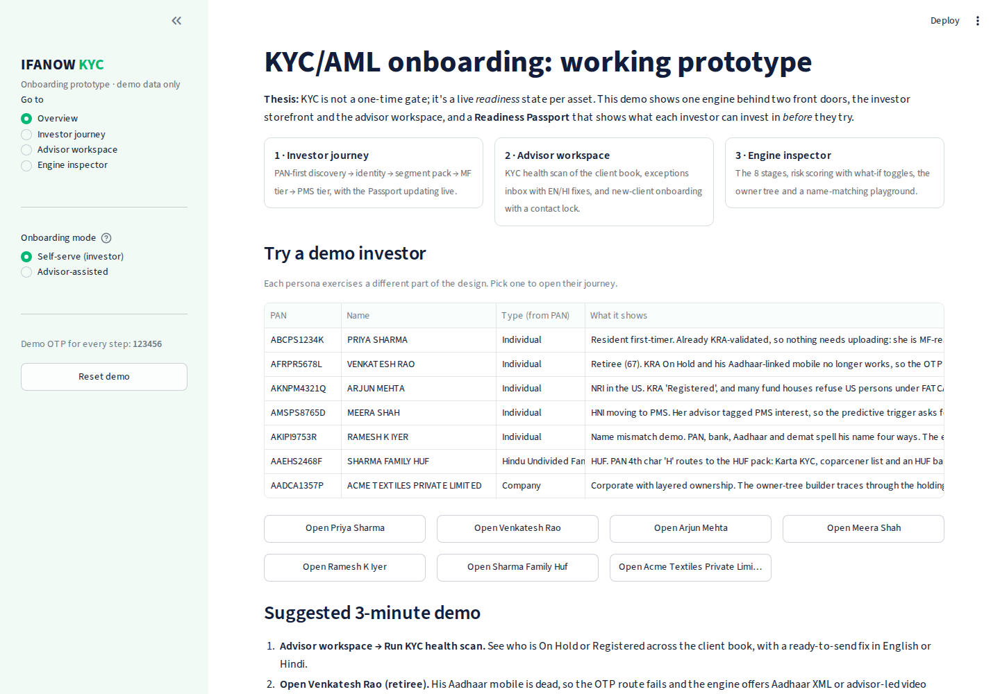

# IFANOW · KYC/AML Onboarding Prototype

A clickable prototype of the KYC/AML onboarding design from my IFANOW Product Intern assignment.

**Thesis:** KYC isn't a one-time gate. It's a live *readiness* state for each asset. One engine sits behind two front doors (the investor storefront and the advisor workspace), and a **Readiness Passport** shows what an investor can invest in *before* they try.

> Demo data only. Every PAN, name and number is fictional, and calls to the Income Tax Dept, KRA, CKYC, DigiLocker, penny drop, depositories and Account Aggregator are simulated. In production these would be API integrations; the rules layer stays the same.



## What you can try

| Area | What it shows |
|---|---|
| **Investor journey** | PAN-first discovery (the 4th PAN character sets the holder type) → identity core → segment pack → Tier 1 MF-ready → Tier 2 PMS-ready, with the Passport updating live |
| **Advisor workspace** | KYC health scan across the client book, exceptions inbox with EN/HI fix messages, pipeline, and family onboarding with a **contact lock** |
| **Engine inspector** | The 8 stages (Capture → Validate → Verify → Reconcile → Screen → Score → Route → Monitor), risk scoring with what-if toggles, owner tree, name-matching playground, audit trail |

### Demo personas

| PAN | Persona | Shows |
|---|---|---|
| `ABCPS1234K` | Priya Sharma | Resident, already KRA-validated, so she's MF-ready in minutes |
| `AFRPR5678L` | Venkatesh Rao (67) | KRA On Hold, Aadhaar mobile dead, so the Aadhaar XML / video KYC fallback kicks in |
| `AKNPM4321Q` | Arjun Mehta (US NRI) | KRA Registered, FATCA filter on fund houses, NRE/NRO check |
| `AMSPS8765D` | Meera Shah (HNI) | Predictive trigger for PMS, Account Aggregator source of funds, pack sent to the PMS provider |
| `AKIPI9753R` | Ramesh K Iyer | Name mismatch across PAN, Aadhaar, bank and demat. Only PMS gets blocked |
| `AAEHS2468F` | Sharma Family HUF | HUF pack: Karta, coparceners, minor handled by guardian |
| `AADCA1357P` | Acme Textiles Pvt Ltd | Owner tree traced through a holding LLP to people with more than 10% |

The demo OTP is **123456** everywhere. Any other valid-format PAN starts a brand-new investor journey.

### 3-minute demo script
1. **Advisor workspace → Run KYC health scan.** See who is On Hold or Registered, with a ready-to-send fix in English or Hindi.
2. **Venkatesh Rao → Step 1 → Fetch from DigiLocker.** The OTP fails, and the fallback appears instead of a dead end.
3. **Ramesh K Iyer.** The bank name is auto-accepted (0.93), Aadhaar needs a declaration (0.80), and the demat mismatch (0.70) blocks **only** PMS.
4. **Meera Shah → Step 4.** Account Aggregator consent verifies source of funds, and the pre-verified pack is sent to the PMS provider.
5. **Switch to Advisor-assisted mode** and try entering the advisor's own mobile (`9800000001`) for a client. The contact lock blocks it.
6. **Engine inspector:** toggle PEP or sanctions and watch the risk band and routing change.

## Run locally

```bash
pip install -r requirements.txt
streamlit run app.py
```

## Deploy free on Streamlit Community Cloud

1. Create a **public** GitHub repo (e.g. `ifanow-kyc-prototype`) and upload everything in this folder, keeping the structure (`app.py`, `engine/`, `.streamlit/`, `requirements.txt`, `docs/`).
2. Go to **share.streamlit.io**, sign in with GitHub, click **Create app** and choose the repo, branch `main` and main file `app.py`.
3. Click **Deploy**. After a minute or two you get a public URL like `https://<your-app>.streamlit.app` to share with interviewers.

## Project structure

```
app.py               Streamlit UI: overview, investor journey, advisor workspace, engine inspector
engine/pan.py        PAN format validation + holder type from the 4th character
engine/matching.py   Fuzzy name matching (initials, word order, titles, Pvt/Ltd) + actions by threshold
engine/rules.py      Readiness per asset, risk scoring and routing, owner-tree flattening, 8-stage view, EN/HI explanations
engine/data.py       Mock registries and demo personas
.streamlit/          Theme in IFANOW green
docs/screens/        Screenshots
```

## Design principles in the code
- **AI assists, rules decide.** Every approve/block is a deterministic rule in `engine/rules.py`. AI would draft explanations and rank exceptions, but never make the decision.
- **Block only what's affected.** A demat name mismatch blocks PMS, not mutual funds.
- **No dead ends.** Every failure (stale Aadhaar mobile, PAN not linked, registry downtime) has a defined next step.
- **Consent belongs to the investor.** In advisor mode, OTP and eSign happen on the investor's device, and the advisor's own contact details are locked out.

Thresholds and risk weights are illustrative and would be tuned on real data.
